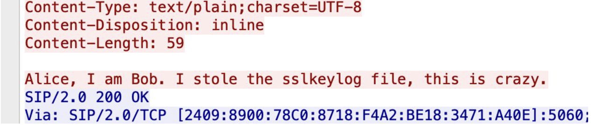
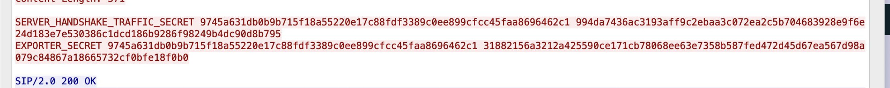
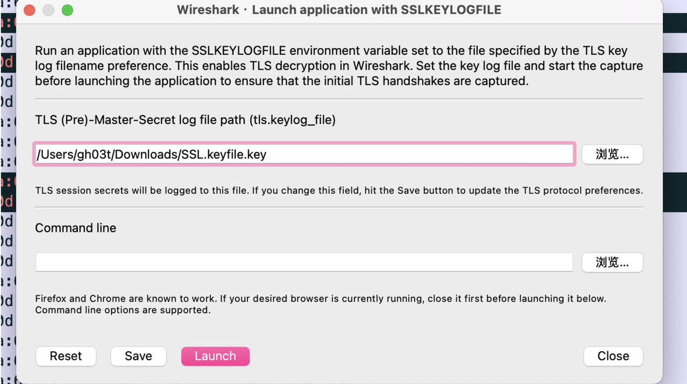
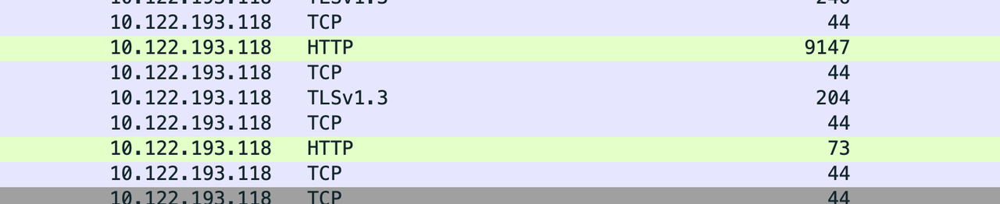
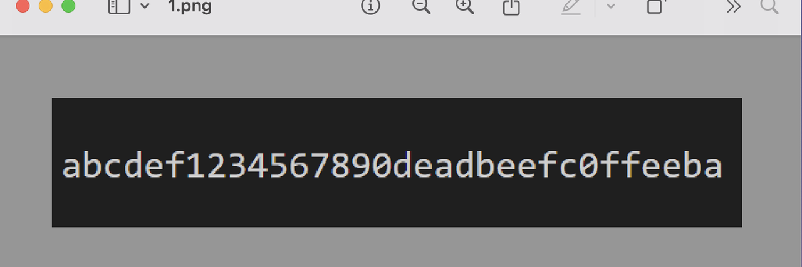
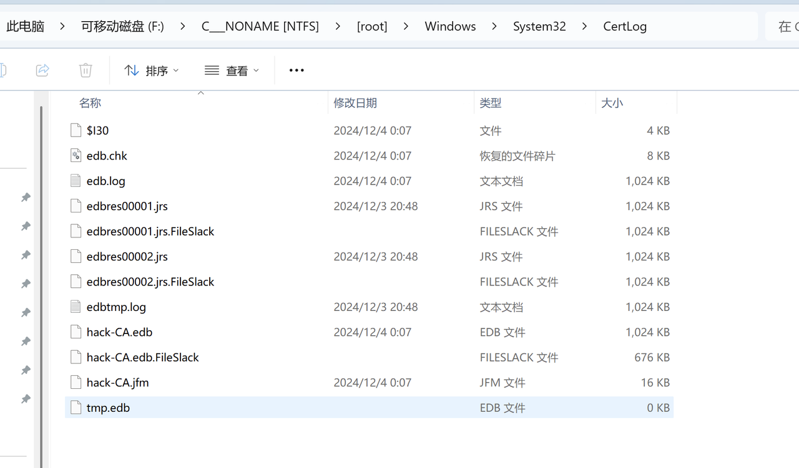
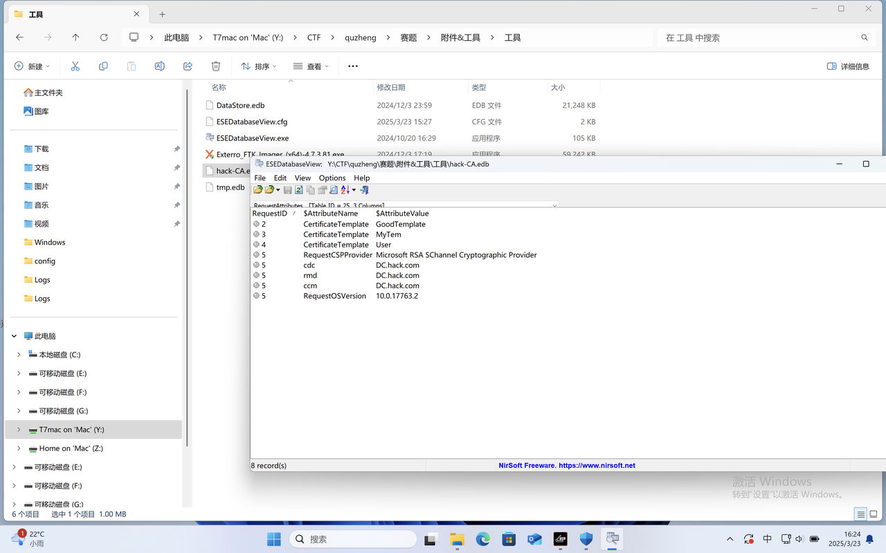
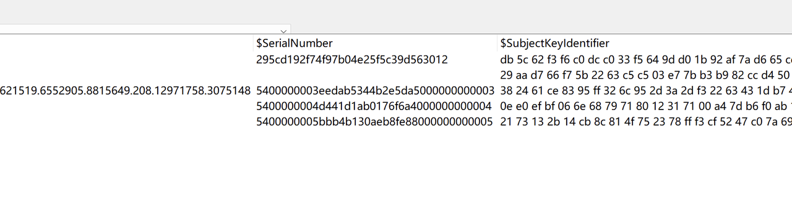
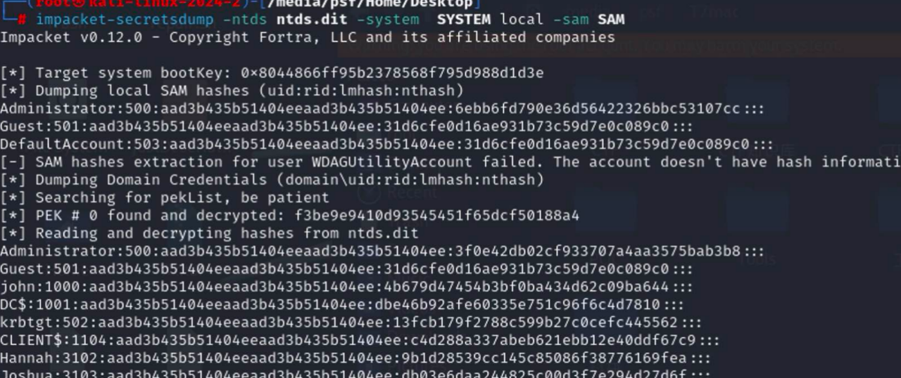
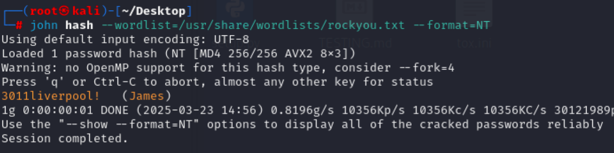

## Table of contents

## PWN-encode

### patch
evilpatch工具通防

## 5G消息—TLS

看到TLS第一时间想的就是找Key 刚开始用的是科来看的流量（但是没有显示SIP流量）

后来使用wireshark看到SIP流量，跟踪TCP流进去看到有一句话和Key





一共三段key，复制出来保存到文件中，导入keyLog解密



能看到两个HTTP请求，其中一个图片是flag






## 取证
做出来了1，2，4 但是3也差不多

### 取证1

要求是去找证书模版名字和序列号

用给的FTK挂在到Windows上，翻文件（因为不知道证书文件夹在哪，刚开始是根据目录的修改时间来看，后面发现有些目录内部文件修改时间会大于目录修改时间，所以后边是硬生生翻出来的）

刚开始是在System32下的一个Cer开头的文件夹下找到了一个证书（但是不对）

后来在



一个edb文件，还是官方给的工具打开




一共几张表 翻翻能翻到模版名和序列号 排列组合交上去




```
MyTem-5400000003eedab5344b2e5da5000000000003
```

### 取证2

要求找到恶意文件，他说被杀了，那就想办法找defender的日志（没看到其他杀毒软件存在的痕迹）

日志文件夹当时也是翻出来的，找到日志之后，要从硬盘中拿出来，不然打开会卡死

日志让我给删了，用当时交wp的截图，（因为当时不知道打开卡死原因，所以用的txt打开）搜索

. e x e


### 取证3

没做出来 但是马上

他说，用的用户名和密码链接的其他机器，但是一般内网渗透抓的都是hash，所以猜测有明文密码存在文件中（后续在取证4爆破hash的时候，john的密码也没爆出来）

翻文件在

```
Users\john\AppData\Roaming\Microsoft\Windows\PowerShell\PSReadLine
```

找到一个有明文密码的脚本


但是提交的时候IP没找对，在某个日子文件中找到了一个192.168.17.128  后边听师哥说好像还有个192.168.17.1

### 取证4 

他说创建了新用户，新用户组，并且用户放入了新用户和用户组，所以按照windows日志事件ID

windwos 4728： A member was added to a security-enabled global group

（截图没了）

找到了用户组 用户 maintainer-James

后续就是找凭证，刚开始是拿的SAM和SYSTEM文件找hash，发现没有James hash，所以James是个域用户，之后就用ntds.dit文件导出的域用户hash



最后就是rockyou爆破



## 总结

据说Web的patch很抽象，我们是没修成功