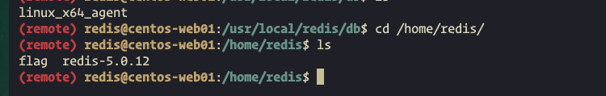
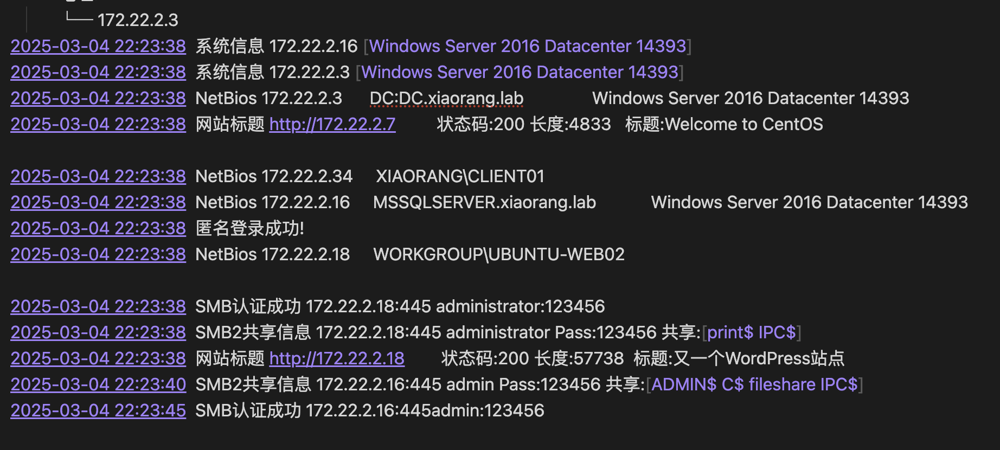
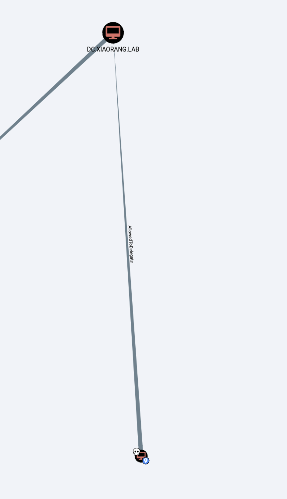
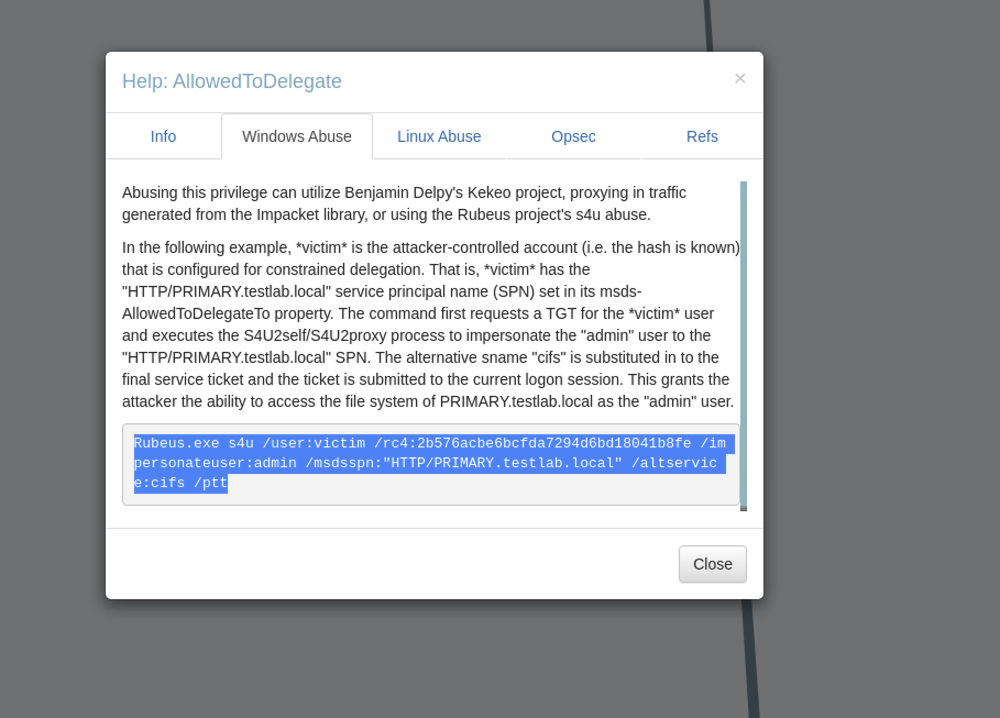
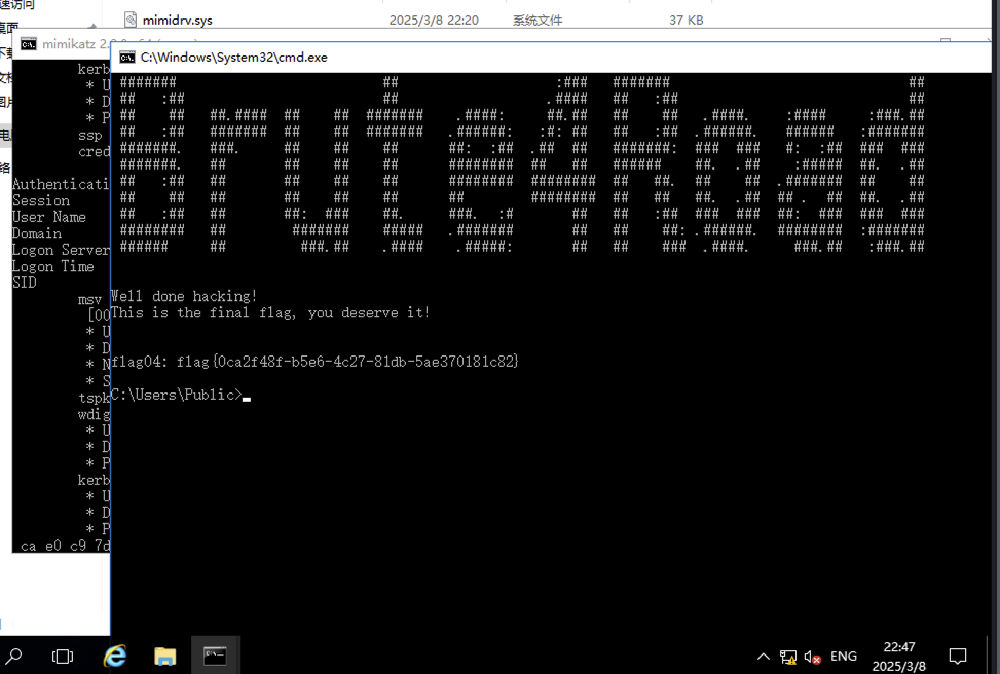

## Table of contents

##  开篇 flag01 
nmap扫描 发现开着6379端口 

https://book.hacktricks.wiki/zh/network-services-pentesting/6379-pentesting-redis.html

工具redis-rogue-server 弹shell 上传fscan 搭建代理

flag1结束

## flag2

（截图不全）
发现 wp站点 mssqlserver服务器 smb+弱口令 CVE
后续CVE看了，说打上去60分钟机器会崩，就一直没用 smb也看了，没什么东西

通过代理上wpscan(结果没存，根据某个插件和版本可以找到可以RCE的CVE)

shell管理工具链接上 通过配置文件找到msql账号密码 flag02 在数据库中（没存）

## flag3
另外还有一份hint 猜测是mssql机器的密码
fscan爆破 fscan -h 172.22.2.16 -m mssql -pwdf test.txt

扫出sa的密码 MDUT工具上线 xp_cmdshell可以使用

服务账号 尝试土豆 拿令牌 提权

## flag4
成功后常规信息收集 发现rdp开着

REG QUERY "HKEY_LOCAL_MACHINE\SYSTEM\CurrentControlSet\Control\Terminal Server\WinStations\RDP-Tcp" /V PortNumber 查看远程桌⾯服务是否开启 连接端⼝为 0xd3d

net user创建一个账户 并且放到administrator用户组中

尝试横向 

因为有LDAP 直接用bloodhound 先用脚本手机 ldap信息 down到本地 分析

AllowedToDelegate

bloodhound有利用命令

Rubeus.exe s4u /user:当前用户 /rc4:当前用户hash /impersonateuser:要伪装的用户 /msdsspn:"AllowedToDelegate
的值选一个" /altservice:cifs /ptt

AllowedToDelegate的值可以使用bloodhound查看

可以模拟cifs

执行完成后就是administrator了

