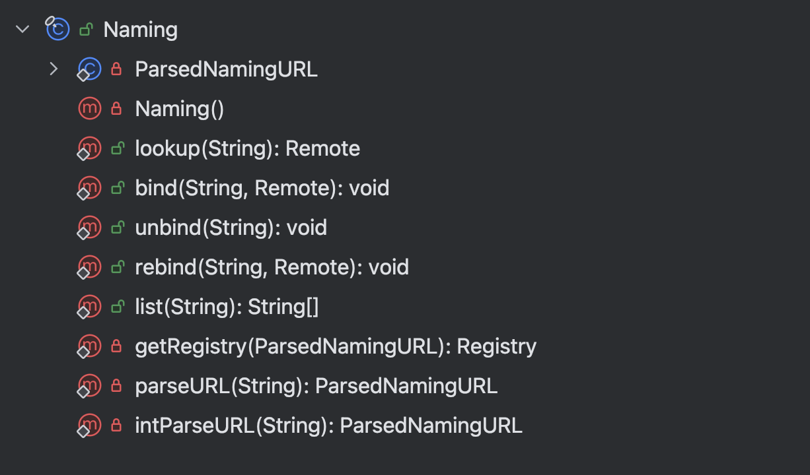
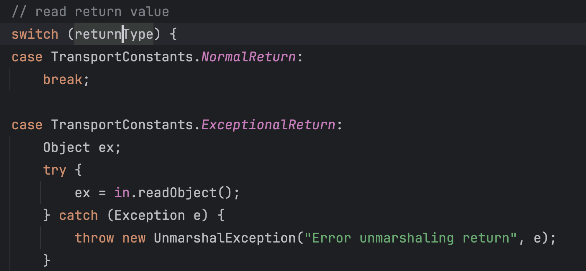
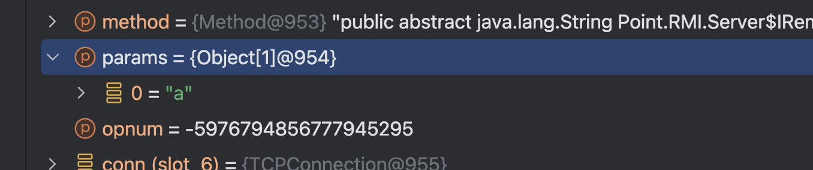

## Table of contents

## 碎碎念

写的有点垃圾 可以看下边连接了解RMI通信原理等动态调试流程

[https://xz.aliyun.com/t/8644]

通信原理这篇博客有个点要注意一下，他太偏原理了，并没有介绍代码中哪一块是可以被利用的

可以自己动手调试一下，注重一下攻击点

下边这篇了解攻击（因为博客时间久远，针对于高版本攻击可能不是那么全面）

[https://xz.aliyun.com/t/7930]

RMI的原理不多赘述（Skeleton，stub等之类）

[https://www.w3cschool.cn/article/30445887.html]

[https://xz.aliyun.com/t/9261]

这里主要说一下他整个的架构


整个RMI可以分为三个部分:注册中心，服务端，客户端。开发人员大多默认注册中心和服务端是在放在同一台机器上的，而在高版本的JDK中，强制注册中心服务端在同一台机器上

但是对于这篇文章，我们将（注册中心，服务端），客户端看成两个点，主要看一下在通信过程中，有没有可以进行攻击的点。

RMI的作用是进行对象的远程方法执行，执行的过程在服务端进行，执行结果返回给客户端

而我们寻找漏洞点的手段有两种，一种是从流量中寻找，看三端通信过程中（主要是客户端和服务端，客户端和注册中心）有没有序列化数据（尝试更更改序列化数据进行反序列化）

还有一种就是动态调试

我们从动态调试的角度去寻找攻击点

## 注册中心和服务端的创建绑定

```java
package Point.RMI;

import java.rmi.Naming;
import java.rmi.Remote;
import java.rmi.RemoteException;
import java.rmi.registry.LocateRegistry;
import java.rmi.registry.Registry;
import java.rmi.server.UnicastRemoteObject;

public class Server {
    public static void main(String[] args) throws Exception { new Server().start(); }
    private void start() throws Exception {
        RemoteHelloWorld h = new RemoteHelloWorld();
        LocateRegistry.createRegistry(1099); // 注册中心
        Naming.rebind("rmi://127.0.0.1:1099/Hello", h); //服务端的绑定
    }
    public interface IRemoteHelloWorld extends Remote { public String hello(String hel) throws RemoteException; }

    public class RemoteHelloWorld extends UnicastRemoteObject implements IRemoteHelloWorld {
        protected RemoteHelloWorld() throws RemoteException {
            super();
        }
        public String hello(String hel) throws RemoteException { System.out.println("hello被调用"); return "Hello world"; }
    }
}
```

因为注册中心和服务端是在同一台机器上，不多做深入挖掘

## 客户端和注册中心服务端的通信

```java
package Point.RMI;

import java.rmi.Naming;


public class Client {


    public static void main(String[] args) throws Exception {
        // 有很多文章在这里会做一个getRegistry的函数，但是lookup会默认的执行这个动作，所以不写也可以
        Server.IRemoteHello hello = (Server.IRemoteHello) Naming.lookup("rmi://127.0.0.1:1099/Hello");
        //调用
        String ret = hello.hello("a");
        //输出返回值
        System.out.println(ret);


    }
}
```

## 注册中心攻击客户端

客户端和注册中心通信是使用的Naming类，先观察一下Naming中有什么方法



尝试一下哪些方法是客户端可以调用并且会和注册中心交互的

经过测试只有lookup和list是可以使用的，那我们关注这两个方法有没有可以利用的点

（静态点函数进去不是这个函数，涉及到了getRegistry的过程，有兴趣可以看一下。或者直接动态跟进去）

```
RegistryImpl_Stub
```

### list

（没找到源码，看反汇编吧）

```java
public String[] list() throws AccessException, RemoteException {
    try {
        RemoteCall var1 = super.ref.newCall(this, operations, 1, 4905912898345647071L);
        super.ref.invoke(var1);

        String[] var2;
        try {
            ObjectInput var5 = var1.getInputStream();
            var2 = (String[])var5.readObject();
        } catch (IOException var12) {
            throw new UnmarshalException("error unmarshalling return", var12);
        } catch (ClassNotFoundException var13) {
            throw new UnmarshalException("error unmarshalling return", var13);
        } finally {
            super.ref.done(var1);
        }

        return var2;
    } catch (RuntimeException var15) {
        throw var15;
    } catch (RemoteException var16) {
        throw var16;
    } catch (Exception var17) {
        throw new UnexpectedException("undeclared checked exception", var17);
    }
}
```

函数中newCall是为发起请求做准备，ref.invoke是真正的请求（这个ref（UnicastRef）也很有意思，具体感兴趣可以自己调一下），这里做了个readObject。var5就是从请求的返回流中读取到的，也就是注册中心返回的信息。

也就是说，如果这时候客户端请求的是一个恶意的注册中心，就可以在客户端做一个反序列化，具体怎么让客户端请求恶意注册中心；
攻击注册中心所在机器接管，控制服务端的lookup参数等等。

如果更进一步的去动态调试ref.invoke的话，他最终走到了StreamRemoteCall的executeCall

有一个很有意思的点在于他在异常处理的时候



如果returnType是ExceptionalReturn的话，也会进行一次反序列化

这就导致了只要是使用ref.invoke进行的请求的话，都会有被注册中心进行攻击的风险

而观察到所有的RegistryImpl\_Stub的方法，都调用ref.invoke进行的请求，也就是都会被攻击

### lookup

lookup方法也是同样的

```java
public Remote lookup(String var1) throws AccessException, NotBoundException, RemoteException {
    try {
        RemoteCall var2 = super.ref.newCall(this, operations, 2, 4905912898345647071L);

        try {
            ObjectOutput var3 = var2.getOutputStream();
            var3.writeObject(var1);
        } catch (IOException var18) {
            throw new MarshalException("error marshalling arguments", var18);
        }

        super.ref.invoke(var2);

        Remote var23;
        try {
            ObjectInput var6 = var2.getInputStream();
            var23 = (Remote)var6.readObject();
        } catch (IOException var15) {
            throw new UnmarshalException("error unmarshalling return", var15);
        } catch (ClassNotFoundException var16) {
            throw new UnmarshalException("error unmarshalling return", var16);
        } finally {
            super.ref.done(var2);
        }

        return var23;
    } catch (RuntimeException var19) {
        throw var19;
    } catch (RemoteException var20) {
        throw var20;
    } catch (NotBoundException var21) {
        throw var21;
    } catch (Exception var22) {
        throw new UnexpectedException("undeclared checked exception", var22);
    }
}
```

这里比较有趣的是客户端在发送请求之前做了一次writeObject，所以我们猜注册中心会readObject，这里到后边再说


## 客户端攻击注册中心

注册中心的断点具体要下到哪个地方需要从注册中心的创建开始调试

一点点调试能看到注册中心使用TCPTransport的listen开了个线程作监听，最终接受信息的地方在同一个类下的handleMessages。最终处理信息的地方在RegistryImpl\_Skel的dispatch

```java
public void dispatch(Remote var1, RemoteCall var2, int var3, long var4) throws Exception {
        if (var4 != 4905912898345647071L) {
            throw new SkeletonMismatchException("interface hash mismatch");
        } else {
            RegistryImpl var6 = (RegistryImpl)var1;
            String var7;
            Remote var8;
            ObjectInput var10;
            ObjectInput var11;
            switch (var3) {
                case 0:
                    try {
                        var11 = var2.getInputStream();
                        var7 = (String)var11.readObject();
                        var8 = (Remote)var11.readObject();
                    } catch (IOException var94) {
                        throw new UnmarshalException("error unmarshalling arguments", var94);
                    } catch (ClassNotFoundException var95) {
                        throw new UnmarshalException("error unmarshalling arguments", var95);
                    } finally {
                        var2.releaseInputStream();
                    }

                    var6.bind(var7, var8);

                    try {
                        var2.getResultStream(true);
                        break;
                    } catch (IOException var93) {
                        throw new MarshalException("error marshalling return", var93);
                    }
                case 1:
                    var2.releaseInputStream();
                    String[] var97 = var6.list();

                    try {
                        ObjectOutput var98 = var2.getResultStream(true);
                        var98.writeObject(var97);
                        break;
                    } catch (IOException var92) {
                        throw new MarshalException("error marshalling return", var92);
                    }
                case 2:
                    try {
                        var10 = var2.getInputStream();
                        var7 = (String)var10.readObject();
                    } catch (IOException var89) {
                        throw new UnmarshalException("error unmarshalling arguments", var89);
                    } catch (ClassNotFoundException var90) {
                        throw new UnmarshalException("error unmarshalling arguments", var90);
                    } finally {
                        var2.releaseInputStream();
                    }

                    var8 = var6.lookup(var7);

                    try {
                        ObjectOutput var9 = var2.getResultStream(true);
                        var9.writeObject(var8);
                        break;
                    } catch (IOException var88) {
                        throw new MarshalException("error marshalling return", var88);
                    }
                case 3:
                    try {
                        var11 = var2.getInputStream();
                        var7 = (String)var11.readObject();
                        var8 = (Remote)var11.readObject();
                    } catch (IOException var85) {
                        throw new UnmarshalException("error unmarshalling arguments", var85);
                    } catch (ClassNotFoundException var86) {
                        throw new UnmarshalException("error unmarshalling arguments", var86);
                    } finally {
                        var2.releaseInputStream();
                    }

                    var6.rebind(var7, var8);

                    try {
                        var2.getResultStream(true);
                        break;
                    } catch (IOException var84) {
                        throw new MarshalException("error marshalling return", var84);
                    }
                case 4:
                    try {
                        var10 = var2.getInputStream();
                        var7 = (String)var10.readObject();
                    } catch (IOException var81) {
                        throw new UnmarshalException("error unmarshalling arguments", var81);
                    } catch (ClassNotFoundException var82) {
                        throw new UnmarshalException("error unmarshalling arguments", var82);
                    } finally {
                        var2.releaseInputStream();
                    }

                    var6.unbind(var7);

                    try {
                        var2.getResultStream(true);
                        break;
                    } catch (IOException var80) {
                        throw new MarshalException("error marshalling return", var80);
                    }
                default:
                    throw new UnmarshalException("invalid method number");
            }

        }
    }
```

可以看到里边处理的方法除了list外，都有readObject,都可以被利用

`ysoserial.exploit.RMIRegistryExploit`


## 客户端攻击服务端

分析客户端和注册中心通信的过程，可以得出最后注册中心的hello变量是个动态代理

Naming.lookup()-> Registry registry = getRegistry(parsed)-> ...->LocateRegistry.getRegistry return (Registry) Util.createProxy(RegistryImpl.class, ref, false)

所以动态调试会走到RemoteObjectInvocationHandler.invoke -> invokeRemoteMethod(proxy, method, args) ->ref.invoke((Remote) proxy, method, args, getMethodHash(method));

ref是UnicastRef

```java
public Object invoke(Remote obj,
                     Method method,
                     Object[] params,
                     long opnum)
    throws Exception
{
    if (clientRefLog.isLoggable(Log.VERBOSE)) {
        clientRefLog.log(Log.VERBOSE, "method: " + method);
    }

    if (clientCallLog.isLoggable(Log.VERBOSE)) {
        logClientCall(obj, method);
    }

    Connection conn = ref.getChannel().newConnection();
    RemoteCall call = null;
    boolean reuse = true;

    /* If the call connection is "reused" early, remember not to
     * reuse again.
     */
    boolean alreadyFreed = false;

    try {
        if (clientRefLog.isLoggable(Log.VERBOSE)) {
            clientRefLog.log(Log.VERBOSE, "opnum = " + opnum);
        }

        // create call context
        call = new StreamRemoteCall(conn, ref.getObjID(), -1, opnum);

        // marshal parameters
        try {
            ObjectOutput out = call.getOutputStream();
            marshalCustomCallData(out);
            Class<?>[] types = method.getParameterTypes();
            for (int i = 0; i < types.length; i++) {
                marshalValue(types[i], params[i], out);
            }
        } catch (IOException e) {
            clientRefLog.log(Log.BRIEF,
                "IOException marshalling arguments: ", e);
            throw new MarshalException("error marshalling arguments", e);
        }

        // unmarshal return
        call.executeCall();

        try {
            Class<?> rtype = method.getReturnType();
            if (rtype == void.class)
                return null;
            ObjectInput in = call.getInputStream();

            /* StreamRemoteCall.done() does not actually make use
             * of conn, therefore it is safe to reuse this
             * connection before the dirty call is sent for
             * registered refs.
             */
            Object returnValue = unmarshalValue(rtype, in);

            /* we are freeing the connection now, do not free
             * again or reuse.
        ...
```

其中需要注意的点

```
marshalValue（序列化数据放入输出流）unmarshalValue（从输入流中读取数据）
```

还有就是我们上边提到过的executeCall（所有客户端发送请求都会调用这个方法）

```java
case TransportConstants.ExceptionalReturn:
    Object ex;
    try {
        ex = in.readObject();
    } catch (Exception e) {
        throw new UnmarshalException("Error unmarshaling return", e);
    }

```


## 服务端攻击客户端

在上文中也说了，客户端会把序列化数据写进输出流，所以服务端会进行读取，我们先看写进去的序列化数据是什么



调试进去是能看到是我们的参数，那看一下服务端反序列化数据在什么地方

和注册中心一样，也是一步步动态调试，最后到达UnicastServerRef.dispatch

```java
public void dispatch(Remote obj, RemoteCall call) throws IOException {
    // positive operation number in 1.1 stubs;
    // negative version number in 1.2 stubs and beyond...
    int num;
    long op;

   ...
        Class<?>[] types = method.getParameterTypes();
        Object[] params = new Object[types.length];

        try {
            unmarshalCustomCallData(in);
            for (int i = 0; i < types.length; i++) {
                params[i] = unmarshalValue(types[i], in);
            }
        } catch (java.io.IOException e) {
            throw new UnmarshalException(
                "error unmarshalling arguments", e);
        } catch (ClassNotFoundException e) {
            throw new UnmarshalException(
                "error unmarshalling arguments", e);
        } finally {
            call.releaseInputStream();
        }
...
```

能看到有unmarshalValue


## DGC

在DGCImpl\_Skel的dispatch中也有readObject可以被利用

yso的JRMP就是利用的这个


在写这篇博客阅读大佬的文章的时候，发现了自己很多不足，包括语言表达，知识层面欠缺，DGC这块就提一下，更多清晰的介绍，请看我开头提到的两篇文章


[https://www.apiref.com/java11-zh/java.rmi/java/rmi/dgc/DGC.html]


