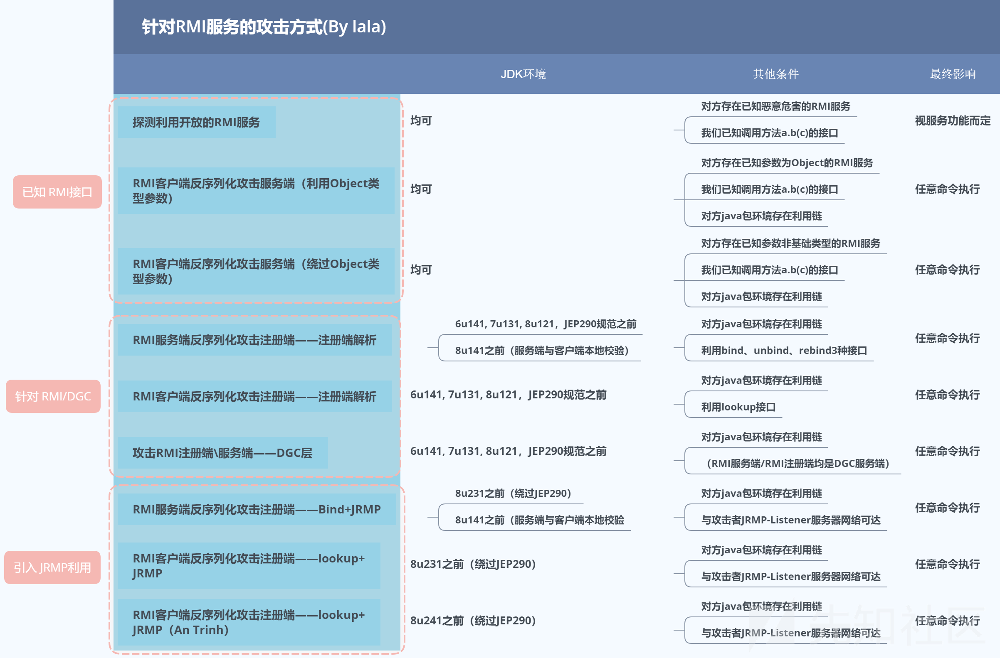

## Table of contents

## RMI篇

攻击：

分为上下两篇，这里只放了上，有点长但是很透彻，

[https://xz.aliyun.com/t/7930]

发帖时间等原因也不全就是了

比如客户端攻击服务端，虽然会check是不是本地，但是是可以进行绕过的（有文章说重写bind的数据写入，把bind的识别写成lookup的，那为啥不直接调用lookup呢），另一个方法是和这篇文章中的客户端打服务端的一样，利用参数（因为服务端和注册端使用的skel是一样的），但是这里设计到的问题是methodHash，调试一下可以发现hash是固定Registry的几个方法的。只要改一下op就可以了

[https://pwnull.github.io/2022/Exploring-JAVA-RMI's-offensive-and-defensive-history/#3-3-%E7%BB%95%E8%BF%872%EF%BC%9A%E7%BB%95%E8%BF%87%E6%9C%AC%E5%9C%B0%E5%9C%B0%E5%9D%80%E9%99%90%E5%88%B6%EF%BC%88CVE-2019-2684%EF%BC%89"]

原理：

可能有点云里雾里，建议跟着复现

[https://xz.aliyun.com/t/8644]

还有下边这个，其实这篇分析的很多是网上没有实现的工具的，目前来说工具是够用的

[https://www.bilibili.com/video/BV1L3411a7ax/]

BV1L3411a7ax

